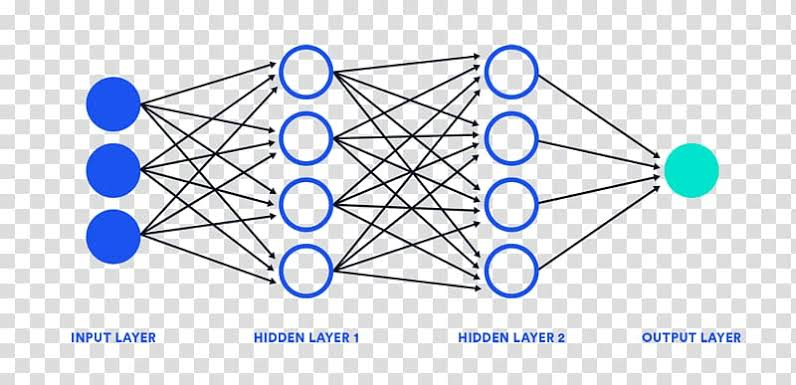

Ever since I first grasped a paintbrush, I’ve always been eager to learn about design. Design is such a complex concept. For example, when looking at abstract art, its meaning can be completely different for different people. It motivates a person to think thoughtfully and has the potential to submerge them in a sea of imagination. It’s that special relationship between the viewer and the art that makes something as technical as software engineering interesting to me.

I never used to think that design and technology went hand in hand.  Thus, learning about software engineering and the role of design has been incredibly interesting to me. Design, implementation, and management are just some of the many things I wish to learn more about. Good art, in a way, makes a person question it. They become joined in the idea of visualization – where captivation meets inspiration.

I am now starting to take a Software Engineering class. I hope to learn a lot through the course, but I know it will be just the beginning of my journey. By the time I’m done with it, I hope I’ve learned enough to take the next step in my life as a developer. But until then, my fire will keep on burning.

What is CNN?
Convolutional Neural Nets (ConvNets or CNN) are a class of neural network specialized for image processing. Like other neural networks, they transform input to output through many layers. In CNN layers have a Convolution step, a pooling step (optional) and a non-linear activation. Each layer in a neural network transforms the input tensor into the output tensor through linear and non-linear operations. All these intermediate tensors (including the network input and output) are called activations and they are all different representations of the input.

This is an architecture of Convolutional Neural Network (CNN)
Why CNN?
We know that Convolutional Neural Networks (CNN) are good at Image Recognition tasks. Now if we have the Image Recognition task then it also can be done with Simple Neural Networks. But if theme images are of large pixels then the problem arises as the number of parameters of the Neural Network will also increase. That makes Neural Networks very slow and computationally expensive.

How Convolutional Neural Network works
The Convolutional Neural Networks can have five, ten or even hundreds of layers that learns to detect different features of a given Image(Say). Filters are applied to each training image at different resolutions. The output of each convolved image is used as an input to the very next layer. The filters can be very simple features like brightness, edges, partial shapes and an increase in complexity to features that uniquely define the given object.

Edge Detection on Images
To understand CNN’s better we have to learn the concept of Convolution with respect to Edge Detection first.
Let’s say, we have a 6x6 image which is a greyscale image (half white and half black)

Here we are representing the original greyscale image with 0 and 255. Where the white part is represented with 0 and the black part is represented by 255.

Here we are just doing componentwise multiplication and then addition.
Now let’s do a calculation to understand it better.

In the above, we are taking the area which is highlighted and doing the componentwise multiplication and then the addition -

So after doing the calculation we place 0 as the first value in the output matrix.
Just like the above, we will repeat this process until we get a 4x4 matrix.

After getting a 4x4 output matrix we are Normalizing Min and Max

Here we are replacing min values (0 in this case) with 0 and max values (1020 in this case) with 255 and making a new 4x4 output image.

Here we are representing the output image in such a way that where we have an edge we replace it with white lines and where there is no edge we will get a dark line.
By doing all these above processes we can detect the horizontal edge of an image.

Padding
We understand from the above that

Here (n x n) is the input, (k x k) is the convolution and (n-k+1)(n-k+1) is the output.
Now let’s say, we have a 6 x 6 (n = 6) matrix and a 3 x 3 kernel (K = 3) and So we will get the output as a 4 x 4 matrix.
But what if we don't want to shrink it and want to have the same output matrix as the input matrix.
To overcome this problem we will apply a trick call Padding.

Here we are doing padding on the given 6 x 6 matrix and making it an 8 x 8 input matrix. Because we know that if we want to get a 6 x 6 output matrix we will have to take an 8 x 8 matrix.
Here we are doing P = 1 and fill the padding with zeros (0). This is called Zero Padding.
Instead of filling it with Zeros (0), we can fill it with the nearest values from the cells. This is called the Same Value Padding.
There are other types of padding also like Raw Padding, Column Padding, Row Padding etc.
Strides

Previously, we are placing the 3 x 3 kernel matrix on top of the input 6 x 6 matrix and doing componentwise multiplication and then addition. Then we are shifting 1 cell. This is called Stride by 1.
Similarly, we can also Shift 2 cells by simply doing Stride = 2 (s = Stride Length)
When we have Strides length of 2 it will simply shift 2 cells both horizontally and vertically.

Here (n x n) = input matrix, s = stride, (k x k) = kernel matrix.
Let’s say, n = 6, k = 3 and s = 2 therefore :

So, from the input 6 x 6 matrix, we will get a 2 x 2 output matrix after stride 2 operation with a kernel size of 3 x 3.

Convolution over RGB images
Unlike the gReyscale images, the RGB images aka colour images consist of 3 colours: Red, Green and Blue. When we put Red, Green, Blue on top of each other we get RGB.

From the above image, we can clearly understand how RGB works internally.

As from the previous examples, we know that we can perform convolution on the 2D matrix. In the case of 3D tensors, the operation remains the same with some slight modifications.

In the above diagram c = 3 (RGB), we can clearly see the operation of convolution in the case of 3D tensors.
Convolution Layer

Convolution layer has multiple kernels of the same size (Sizes can differ but for simplicity, we are taking the same size)
We have to take care of the padding and the strides
The input is a 3D tensor (n x n x c) with 3 channels and we get (n x n x m) matrix as an output.
‘m’ depends on the number of kernels.

Operations

Max Pooling
The concept of Pooling comes from ‘Location Invariant’ (Identification of the object in an image)
There is also ‘Scale-Invariant’ (Helps us identify how small or large the object is) and ‘Rotation Invariant’ (Helps us to identify the rotation of the object)

In Max Pooling we compare the first 4 elements (1, 1, 5, 6) and choose the maximum value (6) amongst them and put it in the output matrix. In the above example we used kernel (k) = 2 and stride (s) = 2. The input matrix is a 4 x 4 matrix and the output is a 2 x 2 matrix.
Now let’s take another example of Max Pooling :

In this above example, we are using kernel (k) = 2 and stride (s) = 1. Here the input matrix is 4 x 4 and the output matrix is 3 x 3

Data Augmentation
Ideally, we want our CNN models to be robust to things like rotation, scale, cropping an image etc.

Let take a dataset D = {xi, yi} and then we create D’ = {xij, yi}
Now for every x1, we are creating a bunch of images. We are doing it by only simple transformations like rotation, adding noise, flipping, shifting, zoom in, zoom out, shear etc.
For every data point in the dataset, we are augmenting the dataset. We will keep original as well as the augmented images.

After learning all of the components of CNN let us see a high-level example of a Convolutional Neural Network :

The activations of an example ConvNet architecture. The initial volume stores the raw image pixels (left) and the last volume stores the class scores (right). Each volume of activations along the processing path is shown as a column. Since it’s difficult to visualize 3D volumes, we lay out each volume’s slices in rows. The last layer volume holds the scores for each class, but here we only visualize the sorted top 5 scores and print the labels of each one.
Here is another example of a ConvNet: Given a Car image it detects the horizontal, vertical and angular edges.

In this above example, we can see multiple levels of features such as
1. Low Level, 2. Mid Level and 3. High Level.
In the lower levels, the kernels are edge detectors but as we move higher it starts detecting shapes (Parts). The higher the layer the more complex abstraction it learns.
Dropout
Dropout refers to ignoring units (Neurons) during the training phase of certain set of neurons which is chosen at random. Here ‘ignoring’, means these units are not considered during a particular forward or backward pass.

At each training stage, individual nodes are either dropped out of the net with probability 1-p or kept with probability p, so that we can achieve a reduced network. Here incoming and outgoing edges to a dropped-out node are also removed.

Fully Connected Layer
After the pooling layer, we flattened our data into a vector and feed it into a fully connected layer like in a normal neural network. We have this layer in order to add non-linearity to our data.
As an example of a human face, the convolutional layer might be able to identify features like faces, mouth, nose, ears etc. However, they do not know the position or where these features should be. With the fully connected layers, we combined these features together to create a more complex model that could give the network more prediction power as to where these features should be located in order to classify it as human.
ReLU (Rectified Linear Unit)
As the human brain never stops learning, the brain always learns from the observations and experiences i.e. the inputs which it receives from the sensory organs are utilized at some or another point but the learning never becomes “Zero”.
To add this feature to the neural networks ReLU is used. The activation function is : f(x) = max(0,x). For any activation function, we must be able to take the derivative of that function and with ReLU we can do that. But the derivative at zero is not defined for the ReLU. Due to zero, we can have the problem of a dead activation state. This implies there will be no weight change meaning no learning. But for humans, it doesn’t happen very often. To solve this problem the concept of Leaky ReLU is introduced.
Steps of biulding a CNN model
First, we need to feed the input into the Convolutional layer
Then we have to choose the correct parameters for the convolution includeing filter size, padding and strides. Then we will perform Convolution on top of the input image.
Then we will apply ReLU on Top of it.
We also do pooling to the output to reduce the size.
We can add as many Convolution layers as we want and also use dropouts.
Then we will flatten the output and feed into a Fully connected layer.
Then finally the output will be passed through an Activation function (Sigmoid or Softmax) and we will get the desired result.
The diagram below shows the architecture of a CNN model :

Types of CNN
LeNet
AlexNet
VGG 16
VGG 19
ResNet
Inception Net
GoogLeNet etc.
Code for CNN
The below CNN Model is just an example of an Image Classification problem :

After the writing the above code the CNN model looks like this :

Then we fit/train the model and then at last test the accuracy :

P.S: We have to import and install the required libraries before implementing this code.
Conclusion
This blog is just an overview and a beginner's guide to the world of CNN. It can be overwhelming at first because of its variety and vastness but if you wish to know more about CNN you can read a lot about them from the following references and also from other various resources on the internet.
Thanks, everyone for your precious time and Happy Learning 😊
Reference
CNN related videos from https://www.appliedaicourse.com/
http://cs231n.github.io/convolutional-networks/
https://www.mathworks.com/solutions/deep-learning/convolutional-neural-network.html
https://blog.floydhub.com/building-your-first-convnet/
https://medium.com/@gopalkalpande/biological-inspiration-of-convolutional-neural-network-cnn-9419668898ac
https://blog.datawow.io/interns-explain-cnn-8a669d053f8b
https://medium.com/@amarbudhiraja/https-medium-com-amarbudhiraja-learning-less-to-learn-better-dropout-in-deep-machine-learning-74334da4bfc5
