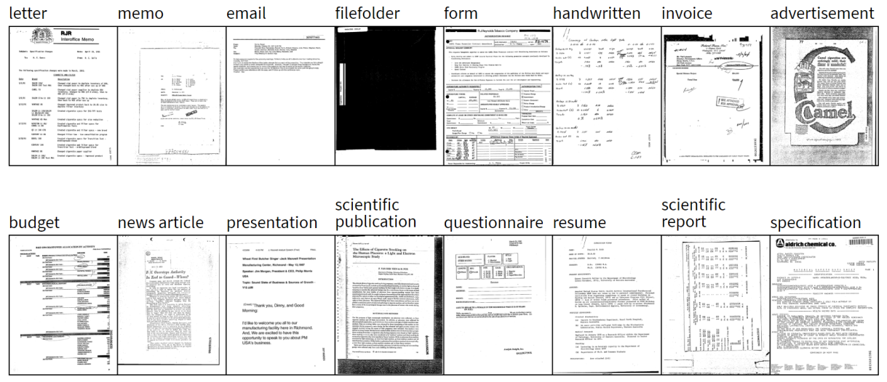

The RVL-CDIP (Ryerson Vision Lab Complex Document Information Processing) dataset consists of 400,000 grayscale images in 16 classes, with 25,000 images per class. There are 320,000 training images, 40,000 validation images, and 40,000 test images. The images are sized so their largest dimension does not exceed 1000 pixels.

 
To read the full blog please visit : [Here](https://medium.com/@souravbanerjee216/document-image-classification-fc7584325c8f)
