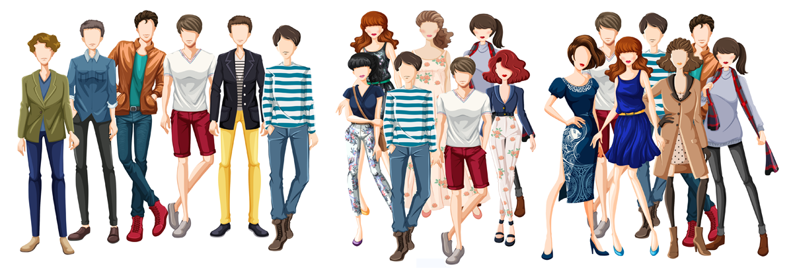

Amazon Fashion is your ultimate destination for head-to-toe style. From all-star athletic brands like adidas and Nike to designers such as kate spade new york and Calvin Klein, Amazon Fashion has something for every occasion and style. In true Amazon spirit, ordering, trying on, and sending back pieces is a breeze, thanks to free shipping and free returns on eligible items. You can search the site for specific styles or browse the curated collections of our favorite shoes, luggage, dresses, and more. Whether you’re looking for the latest, in-demand on trend pieces or wardrobe staples and basics, Amazon Fashion makes it possible to shop efficiently and stylishly. Our roster of brands includes favorites like Van’s, Michael Kors, New Balance, Tommy Hilfiger, Sketchers, Crocs, and hundreds more. Within these brands, you’ll find a range of categories such as jeans, boots, and jewelry plus great gift ideas for everyone on your list. Amazon Fashion offers stylish finds for everybody. In addition to clothes, shoes, and accessories for men and women, there are also choices for the littlest members of your family. Amazon Fashion has everything from kid’s backpacks to snow boots, plus everyday essentials for baby. And with shops dedicated to plus, petite, and big and tall sizes, Amazon Fashion ensures every shopper can put their fashionable foot forward. At Amazon Fashion, we’re committed to helping shoppers be their most stylish selves—even after their packaged has been delivered.

<b>Problem Statement</b> : In this challenge, we are Recommending similar Apprel items/products from Amazon fashion products.

<b>Source</b> : [https://drive.google.com/open?id=0BwNkduBnePt2VWhCYXhMV3p4dTg](https://drive.google.com/open?id=0BwNkduBnePt2VWhCYXhMV3p4dTg)

<b>Real-world/Business Objectives and Constraints</b> : 
1. The cost of a mis-classification may be high or may be low depending upon the situation.
2. There is strict latency concerns.
3. It will help everyone to unterstand the insights of a Recommendation systems.

To learn more please visit : [Here](https://github.com/Souravban/Amazon-Fashion-Discovery-Engine)
