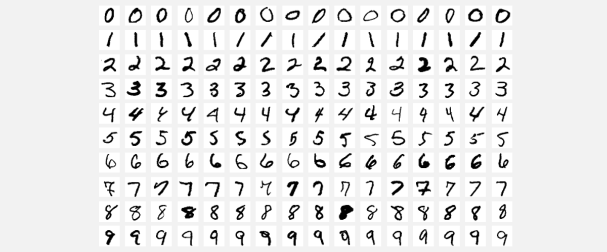

The MNIST database of handwritten digits, available from this page, has a training set of 60,000 examples, and a test set of 10,000 examples. It is a subset of a larger set available from NIST. The digits have been size-normalized and centered in a fixed-size image. It is a good database for people who want to try learning techniques and pattern recognition methods on real-world data while spending minimal efforts on preprocessing and formatting. The original black and white (bilevel) images from NIST were size normalized to fit in a 20x20 pixel box while preserving their aspect ratio. The resulting images contain grey levels as a result of the anti-aliasing technique used by the normalization algorithm. the images were centered in a 28x28 image by computing the center of mass of the pixels, and translating the image so as to position this point at the center of the 28x28 field.

<b>Problem Statement</b> : In this challenge, we are Building various MLP architectures for MNIST Dataset.

<b>Source</b> : [https://s3.amazonaws.com/img-datasets/mnist.npz](https://s3.amazonaws.com/img-datasets/mnist.npz)

To learn more please visit : [Here](https://github.com/Souravban/Building-Various-MLP-Architectures-on-MNIST)
