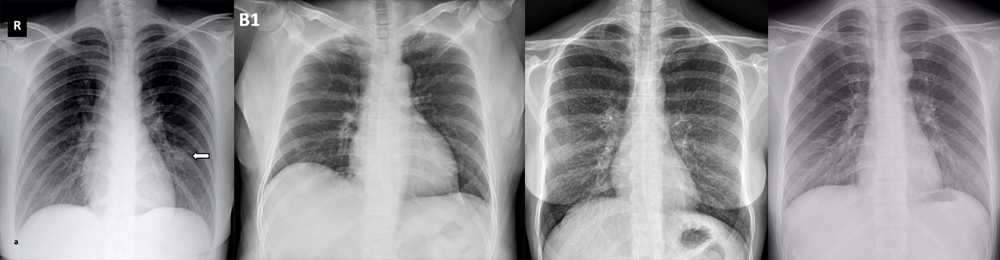

Coronavirus disease 2019 (COVID-19) is an infectious disease caused by severe acute respiratory syndrome coronavirus 2 (SARS-CoV-2). It was first identified in December 2019 in Wuhan, Hubei, China, and has resulted in an ongoing pandemic. The first confirmed case has been traced back to 17 November 2019 in Hubei. Traces of the virus have been found in wastewater that was collected from Milan and Turin, Italy, on 18 December 2019. As of 29 June 2020, more than 10.1 million cases have been reported across 188 countries and territories, resulting in more than 501,000 deaths. More than 5.14 million people have recovered.

Common symptoms include fever, cough, fatigue, shortness of breath, and loss of smell and taste. While the majority of cases result in mild symptoms, some progress to acute respiratory distress syndrome (ARDS) possibly precipitated by cytokine storm, multi-organ failure, septic shock, and blood clots. The time from exposure to onset of symptoms is typically around five days, but may range from two to fourteen days.

<b>Problem Statement</b> : In this challenge, we are classifying of various chest X-Ray images which will help us detect Covid-19.

<b>Real-world/Business Objectives and Constraints</b> : 
1. The cost of a mis-classification can be high.
2. There is a strict latency concerns.

To learn more please visit : [Here](https://github.com/Souravban/COVID-19-Detection-from-X-Ray-Images)
