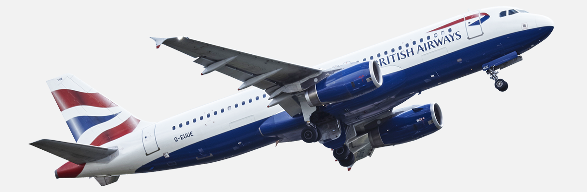

Guessing the flight prices can be very hard sometimes, today we might see a price but when we check out the same flight the price might be different. We might have often heard travelers saying that flight ticket prices are so unpredictable. Here we will be provided with different prices of flight tickets for various airlines between the months of March and June of 2019 and between various cities.

<b>Problem Statement</b> : <b>In this challenge, I am using these flight records to determine flight prices based on the different parameters.</b>

<b>Source</b> : [https://www.kaggle.com/nikhilmittal/flight-fare-prediction-mh](https://www.kaggle.com/nikhilmittal/flight-fare-prediction-mh)

<b>Data Description</b> : 

<b>Airline</b>
<b>Date_of_Journey</b>
<b>Source</b>
<b>Destination</b>
<b>Route</b>
<b>Dep_Time</b>
<b>Arrival_Time</b>
<b>Duration</b>
<b>Total_Stops</b>
<b>Additional_Info</b>
<b>Price</b>

<b>Real-world/Business Objectives and Constraints</b> : 
1. The cost of a mis-classification can be high.
2. No strict latency concerns.

To learn more please visit : [Here](https://github.com/iamsouravbanerjee/Flight-Fare-Prediction)
