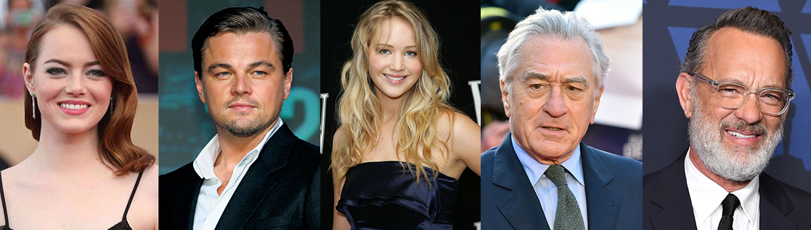

Image classification is a supervised learning problem: define a set of target classes (objects to identify in images), and train a model to recognize them using labeled example photos. Early computer vision models relied on raw pixel data as the input to the model. However, as shown in Figure 2, raw pixel data alone doesn't provide a sufficiently stable representation to encompass the myriad variations of an object as captured in an image. The position of the object, background behind the object, ambient lighting, camera angle, and camera focus all can produce fluctuation in raw pixel data; these differences are significant enough that they cannot be corrected for by taking weighted averages of pixel RGB values.

<b>Problem Statement</b> : In this challenge, we are building a Hollywood Actor Classifier with help of random pictures of the Hollywood Actors.

<b>Source</b> : All the pictures of the Hollywood Actors is downloaded from the internet.

<b>Real-world/Business Objectives and Constraints</b> : 
1. The cost of a mis-classification can be high.
2. There is strict latency concerns.

To watch the Demo please visit: [Demo](https://www.youtube.com/watch?v=cfipz5xF3zQ)

To learn more please visit : [Here](https://github.com/Souravban/Hollywood-Actor-Classifier)
