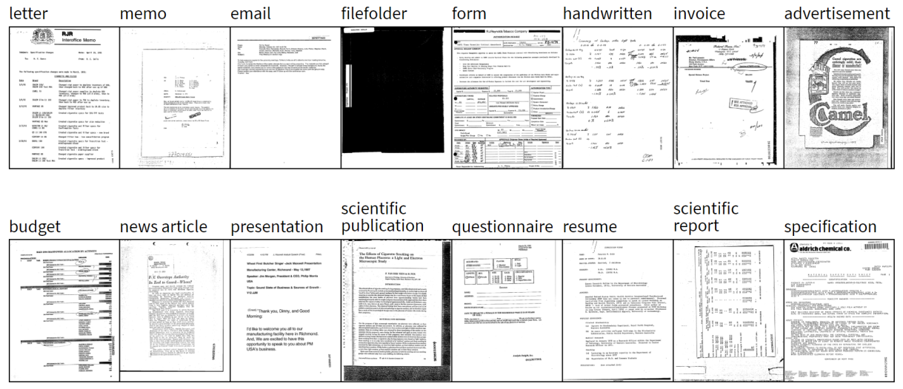

The RVL-CDIP (Ryerson Vision Lab Complex Document Information Processing) dataset consists of 400,000 grayscale images in 16 classes, with 25,000 images per class. There are 320,000 training images, 40,000 validation images, and 40,000 test images. The images are sized so their largest dimension does not exceed 1000 pixels. Here the classes are : 

1. letter
2. form
3. email
4. handwritten
5. advertisement
6. scientific report
7. scientific publication
8. specification
9. file folder
10. news article
11. budget
12. invoice
13. presentation
14. questionnaire
15. resume
16. memo

<b>Problem Statement</b> : Detection of different types of Document images and classify them in different classes like letter, form, email, handwritten, advertisement, scientific report, scientific publication, specification, file folder, news article, budget, invoice, presentation, questionnaire, resume, memo. So It is a Multiclass Classification Problem or we can call it a Computer Vision task.

<b>Source</b> : [http://www.cs.cmu.edu/~aharley/rvl-cdip/](http://www.cs.cmu.edu/~aharley/rvl-cdip/)

A. W. Harley, A. Ufkes, K. G. Derpanis, "Evaluation of Deep Convolutional Nets for Document Image Classification and Retrieval," in ICDAR, 2015

<b>Usage</b> : This dataset is a subset of the IIT-CDIP Test Collection 1.0 [1], which is publicly available here. The file structure of this dataset is the same as in the IIT collection, so it is possible to refer to that dataset for OCR and additional metadata. The IIT-CDIP dataset is itself a subset of the Legacy Tobacco Document Library [2].

<b>Real-world/Business Objectives and Constraints</b> : 
1. The cost of a mis-classification can be high.
2. No strict latency concerns.
3. Computationally Expensive.

To learn more please visit : [Here](https://github.com/Souravban/Image-Classification-Decoded)
