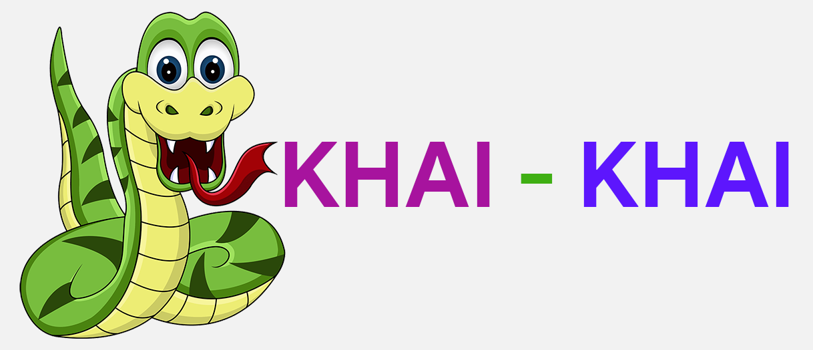

Snake is a video game first released during the mid-1970s in arcades and has maintained popularity since then, becoming something of a classic. After it became the standard pre-loaded game on Nokia phones in 1998, Snake found a massive audience. The player controls a long, thin creature, resembling a snake, which roams around on a bordered plane, picking up food (or some other item), trying to avoid hitting its own tail or the "walls" that surround the playing area. Each time the snake eats a piece of food, its tail grows longer, making the game increasingly difficult. The user controls the direction of the snake's head (up, down, left, or right), and the snake's body follows. The player cannot stop the snake from moving while the game is in progress, and cannot make the snake go in reverse. From the time of its inception, many different versions of snake have been released on various platforms with their own set of rules and controls however the basic rules still follow. The simple mechanics and accessibility of Snake has made it a very popular game throughout the globe. The most popular version of snake was the one that came preloaded with NOKIA 3310 and similar phones. As the phone sold millions of units the Snake game also got exposed to millions of people around the world. Today there are versions of snakes in many languages such as HTML5, Java, Flash, etc.

<b>Problem Statement</b> : We are making a prototype of the famous Snake Game.

<b>Real-world/Business Objectives and Constraints</b> : 
1. It is a very easy to understand and it is an addictive game.
2. It is very lightweight and consumes minimal RAM.
3. No strict latency concerns.
4. The development cost for this program is very low.
5. This project has been developed using Visual Basic 6.0 and therefore it is only compatible with windows systems. The mechanisms of this game is inferior to the snake games of many other platforms.

To learn more please visit : [Here](https://github.com/Souravban/Khai-Khai-A-Snake-Game)
