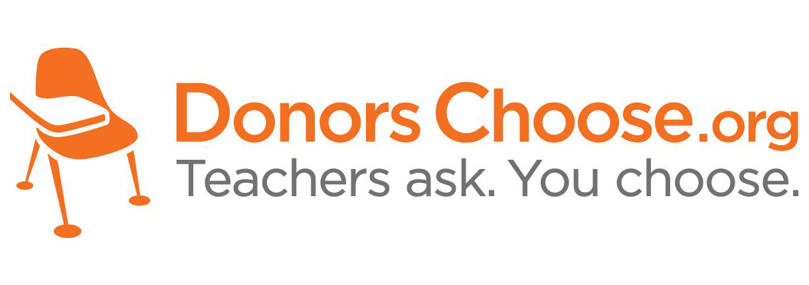

Founded in 2000 by a high school teacher in the Bronx, DonorsChoose.org empowers public school teachers from across the country to request much-needed materials and experiences for their students. At any given time, there are thousands of classroom requests that can be brought to life with a gift of any amount. DonorsChoose.org receives hundreds of thousands of project proposals each year for classroom projects in need of funding. Right now, a large number of volunteers is needed to manually screen each submission before it's approved to be posted on the DonorsChoose.org website. Next year, DonorsChoose.org expects to receive close to 500,000 project proposals. As a result, there are three main problems they need to solve: How to scale current manual processes and resources to screen 500,000 projects so that they can be posted as quickly and as efficiently as possible. How to increase the consistency of project vetting across different volunteers to improve the experience for teachers. How to focus volunteer time on the applications that need the most assistance. 

<b>Problem Statement</b> : The goal of the competition is to predict whether or not a DonorsChoose.org project proposal submitted by a teacher will be approved, using the text of project descriptions as well as additional metadata about the project, teacher, and school. DonorsChoose.org can then use this information to identify projects most likely to need further review before approval

<b>Source</b> : [https://www.kaggle.com/c/donorschoose-application-screening](https://www.kaggle.com/c/donorschoose-application-screening)

<b>Data Description</b> : 

<b>id</b> - unique id of the project application

<b>teacher_id</b> - id of the teacher submitting the application

<b>description</b> - description of the resource requested

<b>quantity</b> - quantity of resource requested

<b>price</b> - price of resource requested

<b>teacher_prefix</b> - title of the teacher's name (Ms., Mr., etc.)

<b>school_state</b> - US state of the teacher's school

<b>project_submitted_datetime</b> - application submission timestamp

<b>project_grade_category</b> - school grade levels (PreK-2, 3-5, 6-8, and 9-12)

<b>project_subject_categories</b> - category of the project (e.g., "Music & The Arts)

<b>project_subject_subcategories</b> - sub-category of the project (e.g., "Visual Arts")

<b>project_title</b> - title of the project

<b>project_essay_1</b> : "Introduce us to your classroom"

<b>project_essay_2</b> : "Tell us more about your students"

<b>project_essay_3</b> : "Describe how your students will use the materials you're requesting"

<b>project_essay_4</b> : "Close by sharing why your project will make a difference"

<b>project_resource_summary</b> - summary of the resources needed for the project

<b>teacher_number_of_previously_posted_projects</b> - number of previously posted applications by the submitting teacher

<b>project_is_approved</b> - whether DonorsChoose proposal was accepted (0="rejected", 1="accepted")

<b>Real-world/Business Objectives and Constraints</b> : 
1. The cost of a mis-classification can be high.
2. No strict latency concerns.

To learn more please visit : [Here](https://github.com/Souravban/LSTM-on-Donors-Choose-Dataset)
