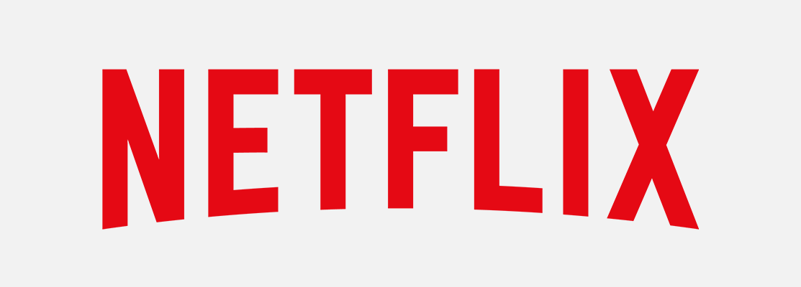

Netflix is all about connecting people to the movies they love. To help customers find those movies, they developed world-class movie recommendation system: CinematchSM. Its job is to predict whether someone will enjoy a movie based on how much they liked or disliked other movies. Netflix use those predictions to make personal movie recommendations based on each customer’s unique tastes. And while Cinematch is doing pretty well, it can always be made better.

Now there are a lot of interesting alternative approaches to how Cinematch works that netflix haven’t tried. Some are described in the literature, some aren’t. We’re curious whether any of these can beat Cinematch by making better predictions. Because, frankly, if there is a much better approach it could make a big difference to our customers and our business.

<b>Problem Statement</b> : In this challenge, Netflix provided a lot of anonymous rating data, and a prediction accuracy bar that is 10% better than what Cinematch can do on the same training data set. (Accuracy is a measurement of how closely predicted ratings of movies match subsequent actual ratings.)

<b>Source</b> : [https://www.kaggle.com/netflix-inc/netflix-prize-data/data](https://www.kaggle.com/netflix-inc/netflix-prize-data/data)

<b>Data Description</b> : 

The first line of each file [<b>combined_data_1.txt, combined_data_2.txt, combined_data_3.txt, combined_data_4.txt</b>] contains the movie id followed by a colon. Each subsequent line in the file corresponds to a rating from a customer and its date in the following format : 
<b>CustomerID, Rating, Date</b>

MovieIDs range from 1 to 17770 sequentially. CustomerIDs range from 1 to 2649429, with gaps. There are 480189 users. Ratings are on a five star (integral) scale from 1 to 5. Dates have the format YYYY-MM-DD.

<b>Real-world/Business Objectives and Constraints</b> : 
1. Predict the rating that a user would give to a movie that he ahs not yet rated.
2. Minimize the difference between predicted and actual rating (RMSE and MAPE)
3. Some form of interpretability.

To learn more please visit : [Here](https://github.com/Souravban/Netflix-Movie-Recommendation-System)
