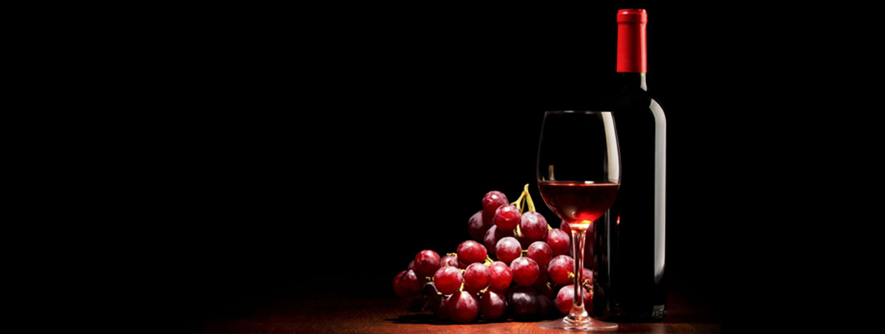

The two datasets are related to red and white variants of the Portuguese "Vinho Verde" wine. For more details, consult the reference [Cortez et al., 2009]. Due to privacy and logistic issues, only physicochemical (inputs) and sensory (the output) variables are available (e.g. there is no data about grape types, wine brand, wine selling price, etc.).

These datasets can be viewed as classification or regression tasks. The classes are ordered and not balanced (e.g. there are much more normal wines than excellent or poor ones).

<b>Problem Statement</b> : In this challenge, we are analysing the Red Wines to find which wine is excellent and which one is poor in quality.

<b>Source</b> : [https://archive.ics.uci.edu/ml/datasets/wine+quality](https://archive.ics.uci.edu/ml/datasets/wine+quality)

<b>Data Description</b> : 

<b>fixed acidity</b> - most acids involved with wine or fixed or nonvolatile (do not evaporate readily)

<b>volatile acidity</b> - the amount of acetic acid in wine, which at too high of levels can lead to an unpleasant, vinegar taste

<b>citric acid</b> - found in small quantities, citric acid can add 'freshness' and flavor to wines

<b>residual sugar</b> - the amount of sugar remaining after fermentation stops, it's rare to find wines with less than 1 gram/liter and wines with greater than 45 grams/liter are considered sweet

<b>chlorides</b> - the amount of salt in the wine

<b>free sulfur dioxide</b> - the free form of SO2 exists in equilibrium between molecular SO2 (as a dissolved gas) and bisulfite ion; it prevents microbial growth and the oxidation of wine

<b>total sulfur dioxide</b> - amount of free and bound forms of S02; in low concentrations, SO2 is mostly undetectable in wine, but at free SO2 concentrations over 50 ppm, SO2 becomes evident in the nose and taste of wine

<b>density</b> - the density of water is close to that of water depending on the percent alcohol and sugar content

<b>pH</b> - describes how acidic or basic a wine is on a scale from 0 (very acidic) to 14 (very basic); most wines are between 3-4 on the pH scale

<b>sulphates</b> - a wine additive which can contribute to sulfur dioxide gas (S02) levels, wich acts as an antimicrobial and antioxidant

<b>alcohol</b> - the percent alcohol content of the wine

<b>quality</b> - output variable (based on sensory data, score between 0 and 10)

<b>Real-world/Business Objectives and Constraints</b> : 
1. The cost of a mis-classification is high.
2. No strict latency concerns.
3. It will help everyone to unterstand the insights of Red Wines.

<h1>ONGOING WORK<h1>

To learn more please visit : [Here](https://github.com/Souravban/Zomato-Restaurant-Analysis)
