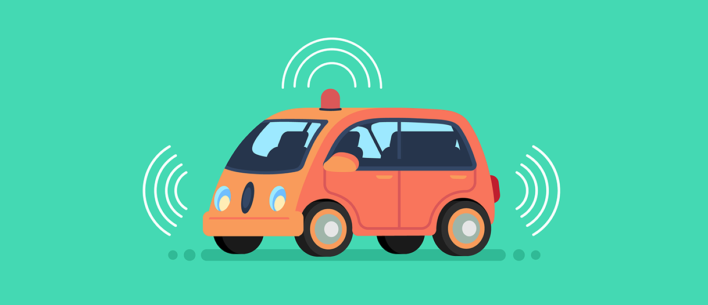

A Self-Driving Car, also known as an Autonomous Vehicle (AV), connected and autonomous vehicle (CAV), driverless car, robo-car, or robotic car, is a vehicle that is capable of sensing its environment and moving safely with little or no human input. Self-driving cars combine a variety of sensors to perceive their surroundings, such as radar, lidar, sonar, GPS, odometry and inertial measurement units. Advanced control systems interpret sensory information to identify appropriate navigation paths, as well as obstacles and relevant signage. Long distance trucking is seen as being at the forefront of adopting and implementing the technology.

<b>Problem Statement</b> : Here we are building as well as analysing a Self Driving Car. It will help us to understand how driverless vehicles can impact humanity.

<b>Real-world/Business Objectives and Constraints</b> : 
1. The cost of a mis-classification can be high.
2. There is very strict latency concerns.
3. It will help everyone to build Cars for the future.

To watch the Demo please visit: [Demo](https://www.youtube.com/watch?v=MYwCRU429LU)

To learn more please visit : [Here](https://github.com/Souravban/Self-Driving-Car)
