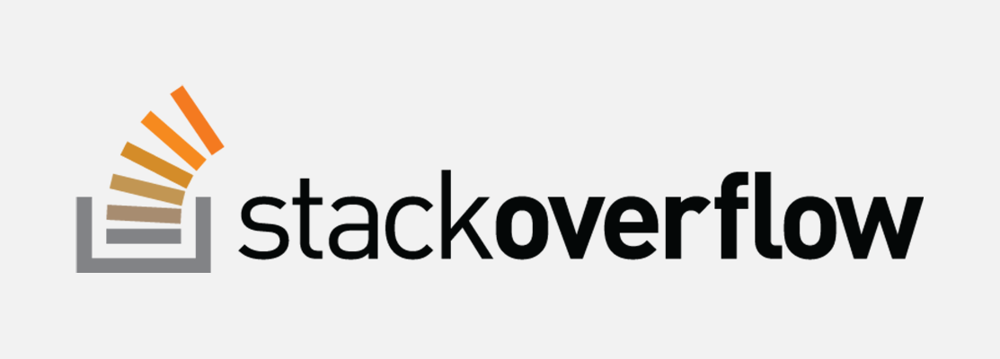

Stack Overflow is the largest, most trusted online community for developers to learn, share their programming knowledge, and build their careers. Stack Overflow is something which every programmer use one way or another. Each month, over 50 million developers come to Stack Overflow to learn, share their knowledge, and build their careers. It features questions and answers on a wide range of topics in computer programming. The website serves as a platform for users to ask and answer questions, and, through membership and active participation, to vote questions and answers up or down and edit questions and answers in a fashion similar to a wiki or Digg. As of April 2014 Stack Overflow has over 4,000,000 registered users, and it exceeded 10,000,000 questions in late August 2015. Based on the type of tags assigned to questions, the top eight most discussed topics on the site are: Java, JavaScript, C#, PHP, Android, jQuery, Python and HTML.

<b>Problem Statement</b> : In this challenge, we are suggesting the tags based on the content that was there in the question posted on Stack Overflow.

<b>Source</b> : [https://www.kaggle.com/c/facebook-recruiting-iii-keyword-extraction/data](https://www.kaggle.com/c/facebook-recruiting-iii-keyword-extraction/data)

<b>Data Description</b> : 

Dataset contains 6,034,195 rows. The columns in the table are:

<b>Id</b> - Unique identifier for each question

<b>Title</b> - The question's title

<b>Body</b> - The body of the question

<b>Tags</b> - The tags associated with the question in a space-seperated format (all lowercase, should not contain tabs '\t' or ampersands '&')

<b>Real-world/Business Objectives and Constraints</b> : 
1. Predict as many tags as possible with high precision and recall.
2. Incorrect tags could impact customer experience on Stack Overflow.
3. No strict latency constraints.

To learn more please visit : [Here](https://github.com/Souravban/Stack-Overflow-Tag-Prediction)
