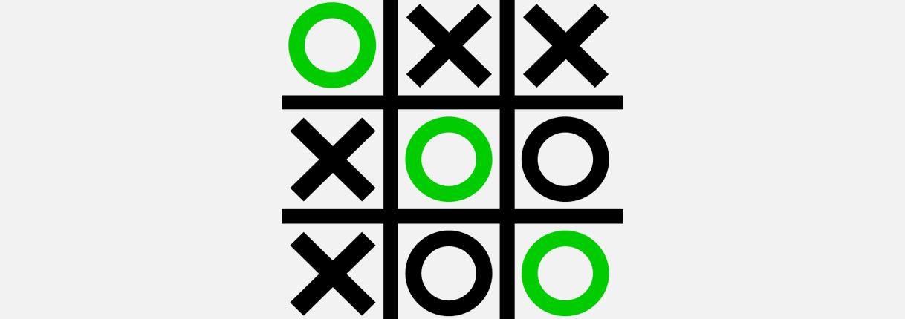

In order to win the game, a player must place three of their marks in a horizontal, vertical, or diagonal row.

Players soon discover that the best play from both parties leads to a draw. Hence, tic-tac-toe is most often played by young children, who often have not yet discovered the optimal strategy. Because of the simplicity of tic-tac-toe, it is often used as a pedagogical tool for teaching the concepts of good sportsmanship and the branch of artificial intelligence that deals with the searching of game trees. It is straightforward to write a computer program to play tic-tac-toe perfectly or to enumerate the 765 essentially different positions (the state space complexity) or the 26,830 possible games up to rotations and reflections (the game tree complexity) on this space.

The game can be generalized to an m,n,k-game in which two players alternate placing stones of their own color on an m×n board, with the goal of getting k of their own color in a row. Tic-tac-toe is the (3,3,3)-game. Harary's generalized tic-tac-toe is an even broader generalization of tic-tac-toe. It can also be generalized as a nd game. Tic-tac-toe is the game where n equals 3 and d equals 2. If played optimally by both players, the game always ends in a draw, making tic-tac-toe a futile game.

<b>Problem Statement</b> : We are making a prototype of the famous game Tic Tac Toe.

<b>Real-world/Business Objectives and Constraints</b> : 
1. This is a very easy to understand and it is an addictive game.
2. No strict latency concerns.
3. It is very lightweight and consumes minimal RAM.
4. It will help everyone to unterstand the insights of a restaurant business.
5. The development cost for this program is very low.
6. This project has been developed using Python3 and therefore it is only compatible with all kinds of Operating Systems.

To learn more please visit : [Here](https://github.com/Souravban/Tic-Tac-Toe)
