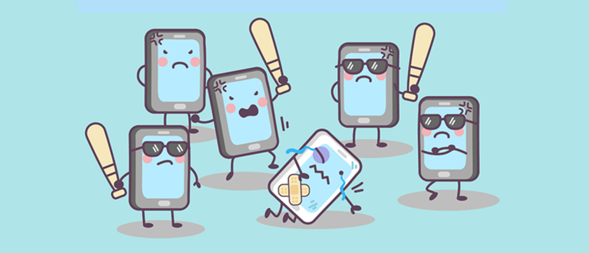

Discussing things you care about can be difficult. The threat of abuse and harassment online means that many people stop expressing themselves and give up on seeking different opinions. Platforms struggle to effectively facilitate conversations, leading many communities to limit or completely shut down user comments.

The Conversation AI team, a research initiative founded by Jigsaw and Google (both a part of Alphabet) are working on tools to help improve online conversation. One area of focus is the study of negative online behaviors, like toxic comments (i.e. comments that are rude, disrespectful or otherwise likely to make someone leave a discussion). So far they’ve built a range of publicly available models served through the Perspective API, including toxicity. But the current models still make errors, and they don’t allow users to select which types of toxicity they’re interested in finding (e.g. some platforms may be fine with profanity, but not with other types of toxic content).

In this Case Study, we are challenged to build a multi-headed model that’s capable of detecting different types of toxicity like threats, obscenity, insults, and identity-based hate better than Perspective’s current models. You’ll be using a dataset of comments from Wikipedia’s talk page edits. Improvements to the current model will hopefully help online discussion become more productive and respectful.

<b>Problem Statement</b> : Detecting different kinds of Toxic Comments and classifying them in different classes like Toxic, Severe Toxic, Obscene, Threat, Insult and Identity Hate. One comment can belongs to 2 or more classes, so we can say that it is Multilabel Classification and not Multiclass Classification. This type of problems belongs to Natural Language Processing (NLP).

<b>Source</b> : [https://www.kaggle.com/c/jigsaw-toxic-comment-classification-challenge/overview](https://www.kaggle.com/c/jigsaw-toxic-comment-classification-challenge/overview)

<b>Usage</b> : The dataset under CC0, with the underlying comment text being governed by Wikipedia's CC-SA-3.0

<b>Real-world/Business Objectives and Constraints</b> : 
1. The cost of mis-classification can be very high.
2. No strict latency concerns.
3. Determining a comment toxic or not is highly subjective from person to person.

		<b> 
<button onclick="window.open('https://nbviewer.jupyter.org/github/iamsouravbanerjee/Toxic-Comment-Classification-Challenge/blob/master/Toxic%20Comment%20Classification%20Challenge.ipynb')" type="button">View Code</button> <button onclick="window.open('https://www.youtube.com/watch?v=Kd5ToGxkFdM')" type="button">Video Explanation</button>    
