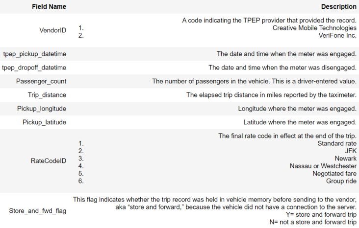

<b>Yellow Taxi : Yellow Medallion Taxicabs</b> : 
These are the famous NYC yellow taxis that provide transportation exclusively through street-hails. The number of taxicabs is limited by a finite number of medallions issued by the TLC. You access this mode of transportation by standing in the street and hailing an available taxi with your hand. The pickups are not pre-arranged.

<b>For Hire Vehicles (FHVs)</b> : 
FHV transportation is accessed by a pre-arrangement with a dispatcher or limo company. These FHVs are not permitted to pick up passengers via street hails, as those rides are not considered pre-arranged.

<b>Green Taxi : Street Hail Livery (SHL)</b> : 
The SHL program will allow livery vehicle owners to license and outfit their vehicles with green borough taxi branding, meters, credit card machines, and ultimately the right to accept street hails in addition to pre-arranged rides.

In the given notebook we are considering only the yellow taxis for the time period between Jan - Mar 2015 & Jan - Mar 2016

<b>Problem Statement</b> : In this challenge, our task is to find number of pickups, given location cordinates (latitude and longitude) and time, in the query reigion and surrounding regions.

<b>Source</b> : [https://www1.nyc.gov/site/tlc/about/tlc-trip-record-data.page](https://www1.nyc.gov/site/tlc/about/tlc-trip-record-data.page)

<b>Data Description</b> : 

<b>Real-world/Business Objectives and Constraints</b> : 
1. The cost of a mis-classification can be high.
2. No strict latency concerns.
3. It will help everyone to unterstand the insights of a restaurant business.

To learn more please visit : [Here](https://github.com/Souravban/New-York-City-Taxi-Demand-Prediction)
