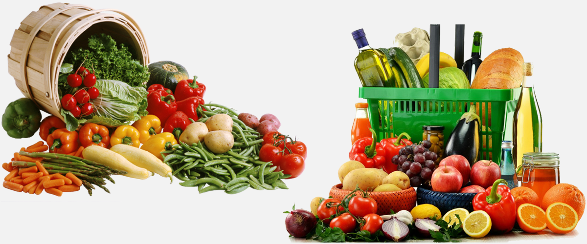

Amazon Fine Food Review dataset consists of reviews of fine foods from amazon. The data span a period of more than 10 years, including all ~500,000 reviews up to October 2012. Reviews include product and user information, ratings, and a plain text review. It also includes reviews from all other Amazon categories.

<b>Number of reviews</b> : 568,454

<b>Number of users</b> : 256,059

<b>Number of products</b> : 74,258

<b>Timespan</b> : Oct 1999 - Oct 2012

<b>Number of Attributes/Columns in data</b> : 10 

<b>Attribute Information</b> :

<b>Id</b> - serial number

<b>ProductId</b> - unique identifier for the product

<b>UserId</b> - unqiue identifier for the user

<b>ProfileName</b> - name which is used by the user

<b>HelpfulnessNumerator</b> - number of users who found the review helpful

<b>HelpfulnessDenominator</b> - number of users who indicated whether they found the review helpful or not

<b>Score</b> - rating between 1 and 5

<b>Time</b> - timestamp for the review

<b>Summary</b> - brief summary of the review

<b>Text</b> - text of the review

<b>Problem Statement</b> : In this challenge, Given a review, we are determining whether the review is positive (Rating of 4 or 5) or negative (rating of 1 or 2).

P.S - A rating of 4 or 5 could be cosnidered a positive review. A review of 1 or 2 could be considered negative. A review of 3 is nuetral and ignored. This is an approximate and proxy way of determining the polarity (positivity/negativity) of a review.

<b>Source</b> : [https://www.kaggle.com/snap/amazon-fine-food-reviews](https://www.kaggle.com/snap/amazon-fine-food-reviews)

<b>Real-world/Business Objectives and Constraints</b> : 
1. The cost of a mis-classification can be high.
2. No strict latency concerns.
3. It will help everyone to unterstand the insights of large scale online businesses.

To learn more please visit : [Here](https://github.com/Souravban/Zomato-Restaurant-Analysis)
