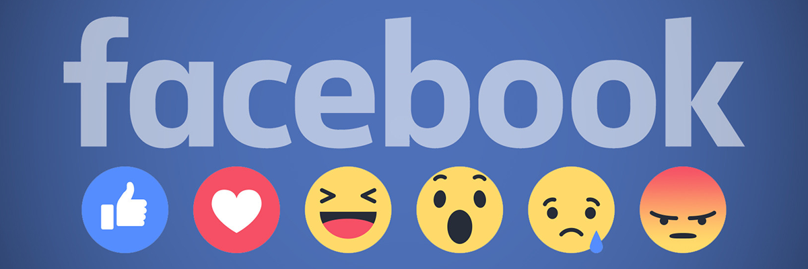

A recommender system, or a recommendation system (sometimes replacing 'system' with a synonym such as platform or engine), is a subclass of information filtering system that seeks to predict the "rating" or "preference" a user would give to an item. They are primarily used in commercial applications.

Visible on your Facebook news feed, the People You May Know box displays users that Facebook thinks you may want to add as a friend. Facebook uses an algorithm to determine which users appear in this box, though users with whom you share mutual friends, went to the same school or previously worked are most likely to appear as a friend recommendation. If you do not ever want to add a particular person as a friend, you can click the "X" beside the person's name to permanently remove him as a friend recommendation.

<b>Problem Statement</b> : In this challenge, Given a directed social graph, we have to predict missing links to recommend users (Link Prediction in graph)

<b>Source</b> : [https://www.kaggle.com/c/FacebookRecruiting/data](https://www.kaggle.com/c/FacebookRecruiting/data)

<b>Mapping the problem into supervised learning problem</b> : Generated training samples of good and bad links from given directed graph and for each link got some features like no of followers, is he followed back, page rank, katz score, adar index, some svd fetures of adj matrix, some weight features etc. and trained ml model based on these features to predict link.

<b>Real-world/Business Objectives and Constraints</b> : 
1. No low-latency requirement.
2. Probability of prediction is useful to recommend highest probability links.

To learn more please visit : [Here](https://github.com/Souravban/Facebook-Friend-Recommendation)
